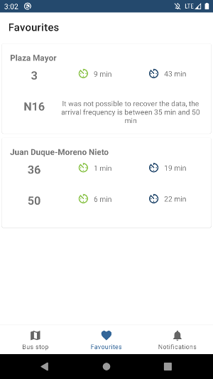

# EasyMadBus
Simplificando los tiempos de espera de buses en Madrid

####  Único click para conocer los tiempos de una parada en el mapa y añadido a favoritos

 | 

####  Detalle de cada parada en favoritos, incluido un modo offline con estimación de tiempos para la parada

 | 

####  Notificaciones en las líneas de buses de Madrid

####  Clusters de nodos anidados para un fácil acceso a los marcadores y algunos añadidos que facilitarán la usabilidad

 | 

####  Compatibilidad con modo oscuro

